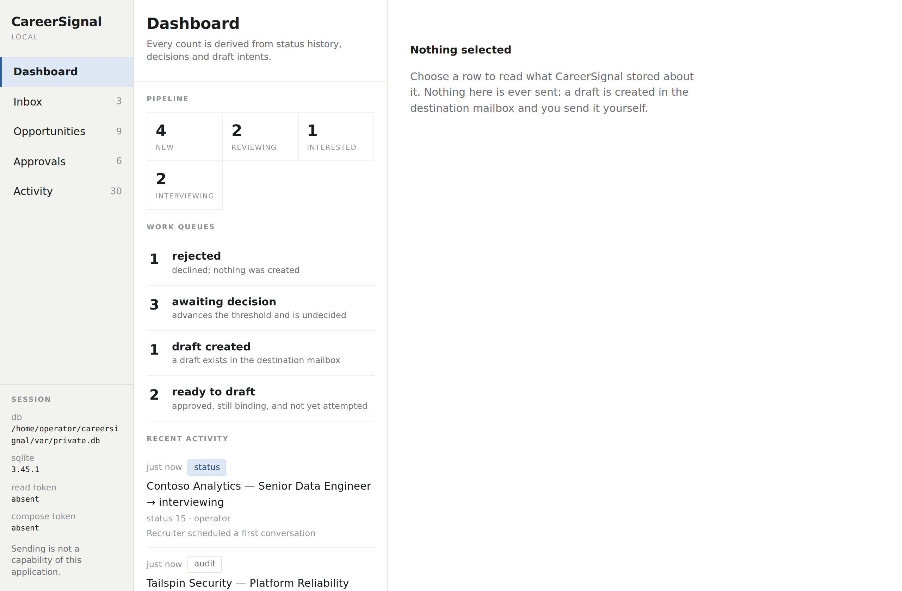

# CareerSignal

A local, human-approved recruiting workflow. CareerSignal reads recruiting messages, deduplicates the opportunities in them, scores each against the skills and locations you configure, explains the score, and keeps an append-only record of what you decided and what was drafted on your behalf. Nothing leaves your machine without an explicit approval bound to exactly what you read.



## What it does and does not do

CareerSignal will:

- ingest structured job records, local `.eml` files, and messages read from a Gmail label under a read-only token;
- extract explicitly labeled jobs (`Title:`, `Company:`, `URL:`, `Location:`, `Skills:`) and refuse to guess at anything else;
- deduplicate by canonical job URL, so the same posting in three alerts is one opportunity;
- score stated-skill coverage and location eligibility, and record the reasons alongside the score;
- track each opportunity through a fixed status vocabulary with a full history of who changed it and why;
- create a Gmail *draft* replying to a recruiter, but only from a review you approved, under a separate compose token, and never twice.

CareerSignal will not:

- send email, submit applications, or click anything;
- parse arbitrary job-board layouts or infer fields that were not stated;
- retry an external write whose outcome is unknown;
- act on an approval whose review, wording, recipient, or destination has changed since you gave it.

CareerSignal is a local CLI and loopback-only browser application with no accounts, no third-party runtime dependencies, and a single SQLite file for state. The design notes in [docs/](docs/) explain each guarantee and the tests that hold it.

## Requirements

Python 3.11–3.14 and [uv](https://docs.astral.sh/uv/). Storage is the interpreter's own SQLite through the standard library; SQLite 3.38 or newer is required and an older runtime is refused with its version named. There are no other runtime dependencies. Linux, macOS, and Windows are all covered by CI.

## Quick start

```sh
uv sync --locked
uv run careersignal version                      # what this interpreter provides
uv run careersignal init --db var/careersignal.db
uv run careersignal verify --db var/careersignal.db
uv run careersignal demo --db var/synthetic.db   # synthetic end-to-end run, no network
```

`version` opens no database. It prints the package, Python and SQLite versions, the SQLite floor, and whether the runtime carries SQLite's WAL-reset fix; it is the first thing to include in a bug report. `demo` is a certification scenario with a simulated approval and an in-memory draft provider; keep it in its own database.

Relative database paths resolve from the current directory. `CAREERSIGNAL_DB_PATH` sets the default; `--db` overrides it. Keep real data under the ignored `var/` directory or outside the tree.

## A search, end to end

**1. Bring opportunities in.** From a saved message file, naming the source and your skills:

```sh
uv run careersignal ingest --message alert.eml --namespace personal-inbox \
  --skill python --skill sql --location remote --db var/private.db
```

Or from a Gmail label, with a read-only token in the environment (never on the command line):

```sh
export CAREERSIGNAL_GMAIL_TOKEN=...
uv run careersignal gmail-ingest --mailbox operator@example.com --label Label_JobAlerts \
  --skill python --skill sql --db var/private.db
```

The intake adapter can address only two Gmail read endpoints on one fixed host, refuses redirects, and verifies that the token belongs to the mailbox you named before it reads anything. It cannot create, modify, or send. See [Gmail intake](docs/gmail-intake.md) and [message extraction](docs/message-extraction.md) for the supported formats and their limits.

**2. See what you have.** Read-only views, as a table or `--json`:

```sh
uv run careersignal opportunities --db var/private.db
uv run careersignal opportunities --active --min-coverage 70 --db var/private.db
uv run careersignal opportunity <id> --db var/private.db
```

The detail view shows the score and its reasons, the status history, whether a draft was attempted, and the exact material an approval would bind: review id, source message, recipient, subject, and wording. See [operator views](docs/operator-views.md).

**3. Move it along.** Each status change names the event you read it against, and is refused if the opportunity moved in between:

```sh
uv run careersignal status <id> --to applied --expect 12 \
  --actor operator --reason "Sent CV" --db var/private.db
```

Statuses are `new`, `reviewing`, `interested`, `applied`, `interviewing`, `offer`, `rejected`, `withdrawn`, `closed`. History is append-only; the current status is derived from it. See [status history](docs/status-history.md).

**4. Approve and draft.** Drafting is the only thing that writes outside this machine, so it takes two explicit steps:

```sh
uv run careersignal approve <review-id> --actor operator --db var/private.db
uv run careersignal draft <review-id> --db var/private.db            # in-memory provider
```

An approval binds one destination, so a real Gmail draft is approved for that mailbox by name:

```sh
export CAREERSIGNAL_GMAIL_COMPOSE_TOKEN=...
uv run careersignal approve <review-id> --actor operator --provider gmail \
  --mailbox operator@example.com --db var/private.db
uv run careersignal draft <review-id> --provider gmail \
  --mailbox operator@example.com --db var/private.db
```

The two blocks are alternatives, not a sequence. A review holds one draft attempt: once one exists the decision is locked for reconciliation, so rehearsing with the in-memory provider spends the review rather than warming up for the real one.

The compose token is a second credential with its own scope, adapter, and path allowlist; the adapter refuses the Gmail send endpoint by path. Before writing, the draft is rechecked against everything the approval bound. If the outcome of the write is unknown, nothing is retried:

```sh
uv run careersignal reconcile <review-id> --provider gmail --mailbox operator@example.com --db var/private.db
```

See [approved drafts](docs/approved-drafts.md) for what an approval binds and how reconciliation finds a draft without creating another.

## What a command tells you

Commands an operator runs print text by default and `--json` on request, and end with one of four outcomes:

| Outcome | Exit | Meaning |
|---|---|---|
| `ACCEPTED` | 0 | It happened. |
| `REFUSED` | 1 | Nothing was sent; this machine declined. Correct the cause and ask again. |
| `PROVIDER_REJECTED` | 1 | A request was sent and the provider's response proves nothing was created. Same safety as refused. |
| `UNCERTAIN` | 3 | A request was sent and the outcome is unknown. Only `reconcile` can say. |

A command written wrongly is exit 2 on stderr, because a mistyped command is not the system refusing. See [the operator interface](docs/operator-interface.md).

## Guarantees, briefly

Message IDs are immutable: the same ID with different content is refused, the same message twice returns the original reviews. A changed review needs a new approval. An approval binds the review's content digest, the exact draft wording, the recipient and subject, and the provider and mailbox, and every one is rechecked inside the transaction that reserves the draft; the status event current when you approved is recorded as evidence, while the draft is judged against the opportunity's status now. A review holds at most one draft attempt at a time: a proven provider rejection releases it, an uncertain outcome locks it until reconciled. Terminal statuses (`rejected`, `withdrawn`, `closed`) refuse a draft. Recruiter-supplied addresses carrying control characters are refused, not repaired. The audit and status-history tables cannot be updated or deleted. Text from recruiters is escaped at the terminal so a job title cannot retitle your window.

The `Repository`, `Intake`, `IntakeActions` and `OutwardActions` classes under `src/` are local trusted-caller APIs, not authenticated endpoints.

## Verify

```sh
uv run pytest -q
uv run ruff check .
uv run ruff format --check .
uv run python ops/tools/verify_tree.py
uv run python ops/tools/verify_secrets.py
uv run python ops/tools/verify_wheel.py
```

The wheel verifier builds a pure-Python wheel, proves it declares no runtime dependency, installs it into an empty environment, and runs the synthetic workflow from there. Hosted CI repeats every gate on Linux, macOS, and Windows for Python 3.11–3.14. See [verification evidence](docs/verification.md).

## Contributing

Read [the build contract](docs/build-contract.md) for folder ownership, dependency direction, privacy rules, and the gates a change must pass. Coding agents must also follow [AGENTS.md](AGENTS.md). Public fixtures are synthetic; personal messages, credentials, and databases never enter the tree.

The historical private repository is a reference for proven behavior only. Its structure, runtime artifacts, and history do not belong here.
